## Descriptives
### Number of responses
#### Flashcard conditions

| | sample | min | max | mean | variance | skew | kurtosis | normal-t | normal-p | $\alpha$ |
|---|---:|---:|---:|---:|---:|---:|---:|---:|---:|---:|
| **abs** | 12 |  298 |  915 |  408.17 |  28248.33 |  2.53 |  5.26 |  26.675 |  0.0000 |  0.8557 |
| **rel** | 12 |  6 |  19 |  8.87 |  13.35 |  2.53 |  5.26 |  26.675 |  0.0000 |  0.8557 |

#### Flashmap conditions

| | sample | min | max | mean | variance | skew | kurtosis | normal-t | normal-p | $\alpha$ |
|---|---:|---:|---:|---:|---:|---:|---:|---:|---:|---:|
| **abs** | 11 |  278 |  471 |  374.36 |  4875.05 |  0.13 | -1.28 |  1.516 |  0.4686 |  0.7098 |
| **rel** | 11 |  5 |  9 |  7.49 |  1.95 |  0.13 | -1.28 |  1.516 |  0.4686 |  0.7098 |

#### Combined conditions

| | sample | min | max | mean | variance | skew | kurtosis | normal-t | normal-p | $\alpha$ |
|---|---:|---:|---:|---:|---:|---:|---:|---:|---:|---:|
| **abs** | 23 |  328 |  1230 |  474.74 |  34192.57 |  3.12 |  10.33 |  41.081 |  0.0000 |  0.8731 |
| **rel** | 23 |  6 |  24 |  9.31 |  13.15 |  3.12 |  10.33 |  41.081 |  0.0000 |  0.8731 |

### Percentage of responses marked as correct
#### Flashcard conditions

| | sample | min | max | mean | variance | skew | kurtosis | normal-t | normal-p | $\alpha$ |
|---|---:|---:|---:|---:|---:|---:|---:|---:|---:|---:|
| **abs** | 12 |  35 |  43 |  40.42 |  4.04 | -1.15 |  1.74 |  8.672 |  0.0131 |  0.9106 |
| **rel** | 12 |  0 |  0 |  0.88 |  0.00 | -1.15 |  1.74 |  8.672 |  0.0131 |  0.9106 |

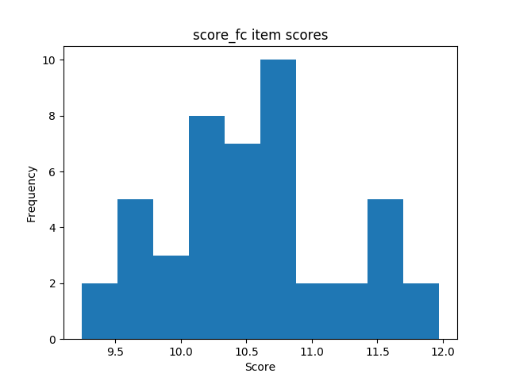
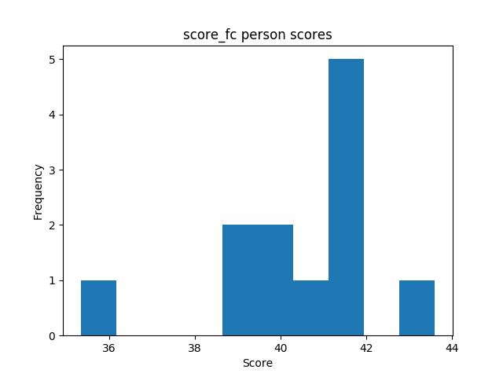

#### Flashmap conditions

| | sample | min | max | mean | variance | skew | kurtosis | normal-t | normal-p | $\alpha$ |
|---|---:|---:|---:|---:|---:|---:|---:|---:|---:|---:|
| **abs** | 11 |  43 |  51 |  47.11 |  6.19 |  0.31 | -1.17 |  1.231 |  0.5404 |  0.9511 |
| **rel** | 11 |  0 |  1 |  0.92 |  0.00 |  0.31 | -1.17 |  1.231 |  0.5404 |  0.9511 |

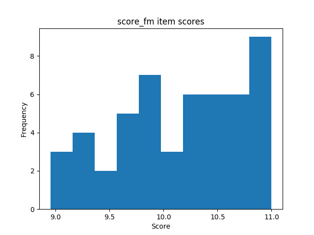
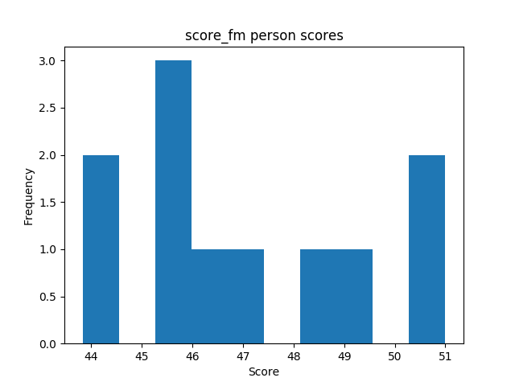

#### Combined conditions

| | sample | min | max | mean | variance | skew | kurtosis | normal-t | normal-p | $\alpha$ |
|---|---:|---:|---:|---:|---:|---:|---:|---:|---:|---:|
| **abs** | 23 |  40 |  51 |  45.97 |  6.47 |  0.06 |  0.22 |  0.711 |  0.7008 |  0.9459 |
| **rel** | 23 |  0 |  1 |  0.90 |  0.00 |  0.06 |  0.22 |  0.711 |  0.7008 |  0.9459 |

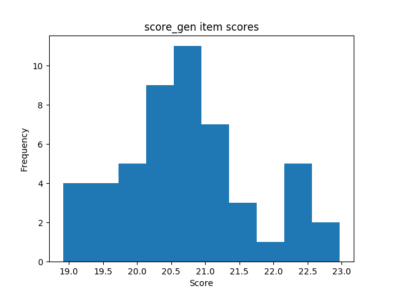
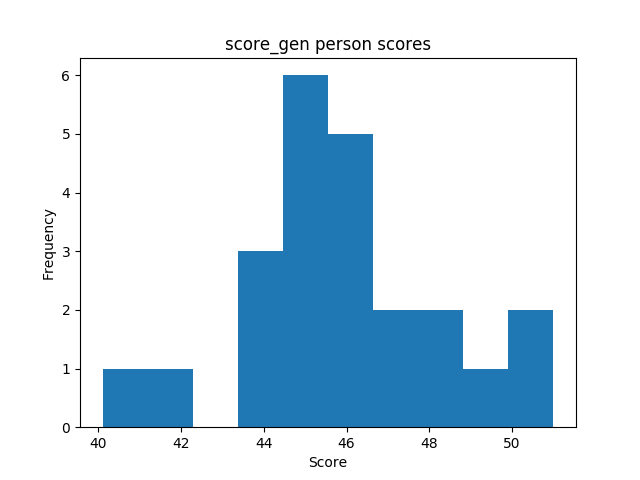

### Amount of time spent on the application
#### Flashcard conditions

| | sample | min | max | mean | variance | skew | kurtosis | normal-t | normal-p | $\alpha$ |
|---|---:|---:|---:|---:|---:|---:|---:|---:|---:|---:|
| **abs** | 12 |  1544 |  12345 |  8173.94 |  10611999.29 | -0.77 | -0.33 |  2.156 |  0.3402 |  0.8776 |
| **rel** | 12 |  33 |  268 |  177.69 |  5015.12 | -0.77 | -0.33 |  2.156 |  0.3402 |  0.8776 |

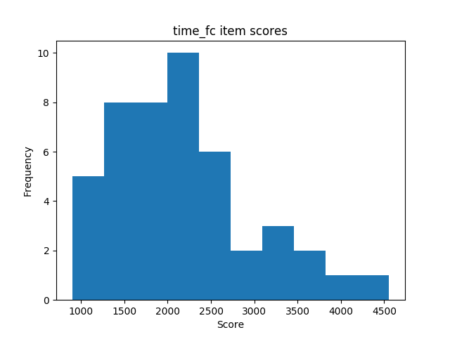
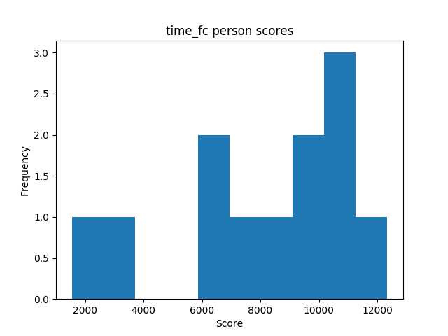

#### Flashmap conditions

| | sample | min | max | mean | variance | skew | kurtosis | normal-t | normal-p | $\alpha$ |
|---|---:|---:|---:|---:|---:|---:|---:|---:|---:|---:|
| **abs** | 11 |  1707 |  12233 |  7221.30 |  8917086.17 |  0.05 | -0.44 |  0.092 |  0.9551 |  0.8268 |
| **rel** | 11 |  34 |  244 |  144.43 |  3566.83 |  0.05 | -0.44 |  0.092 |  0.9551 |  0.8268 |

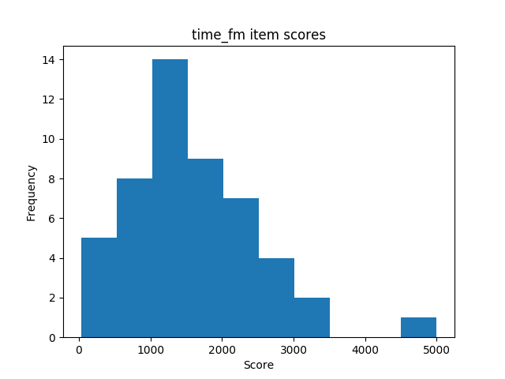
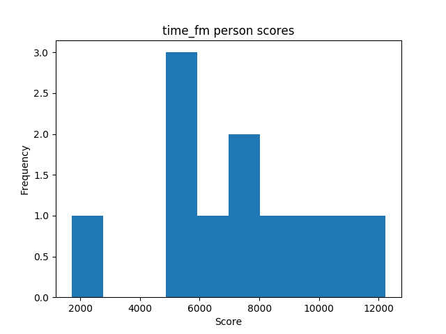

#### Combined conditions

| | sample | min | max | mean | variance | skew | kurtosis | normal-t | normal-p | $\alpha$ |
|---|---:|---:|---:|---:|---:|---:|---:|---:|---:|---:|
| **abs** | 23 |  1426 |  16484 |  9283.95 |  14203173.83 | -0.31 | -0.29 |  0.544 |  0.7617 |  0.8591 |
| **rel** | 23 |  27 |  323 |  182.04 |  5460.66 | -0.31 | -0.29 |  0.544 |  0.7617 |  0.8591 |

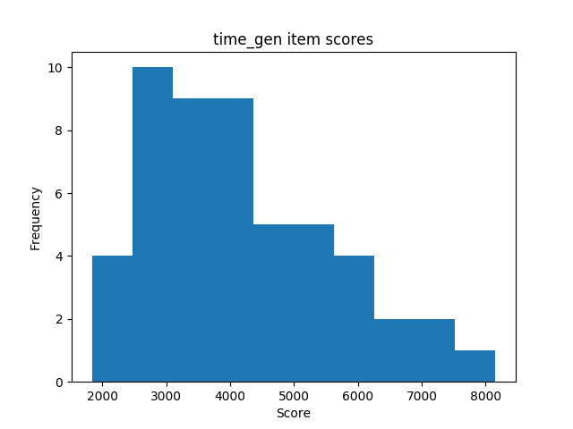
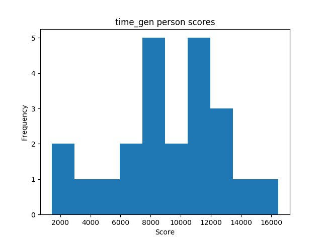

## Comparisons
### Number of responses

| | **Mann-Whitney-U k** | **Mann-Whitney-U p** | **Welch's t-test k** | **Welch's t-test p** |
|---|---:|---:|---:|---:|
| **abs** |  0.619 |  0.5426 |  0.639 |  0.5324 |
| **rel** |  1.180 |  0.2513 |  1.220 |  0.2420 |

### Percentage of responses marked as correct

| | **Mann-Whitney-U k** | **Mann-Whitney-U p** | **Welch's t-test k** | **Welch's t-test p** |
|---|---:|---:|---:|---:|
| **abs** | -16.597 |  0.0000 | -15.857 |  0.0000 |
| **rel** | -16.421 |  0.0000 | -15.689 |  0.0000 |

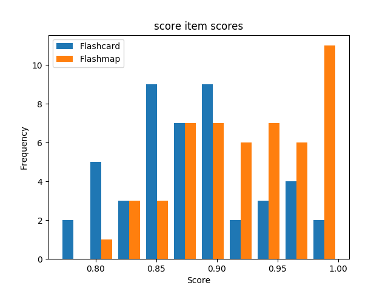
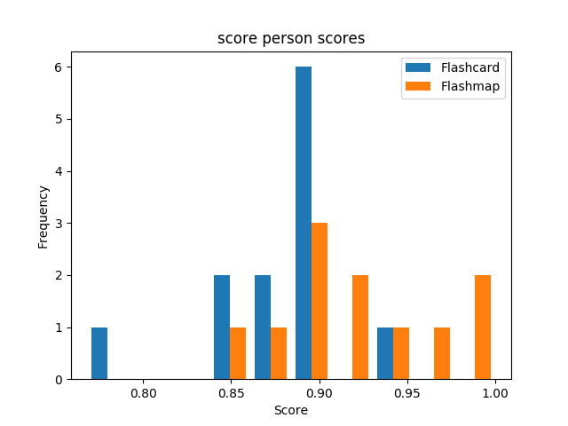

### Amount of time spent on the application

| | **Mann-Whitney-U k** | **Mann-Whitney-U p** | **Welch's t-test k** | **Welch's t-test p** |
|---|---:|---:|---:|---:|
| **abs** |  7.924 |  0.0000 |  8.292 |  0.0000 |
| **rel** |  7.954 |  0.0000 |  8.324 |  0.0000 |

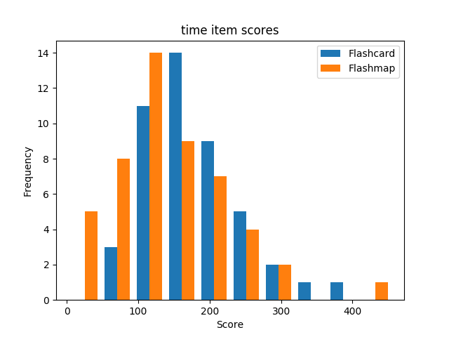
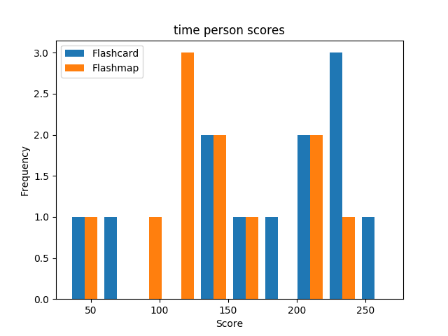
