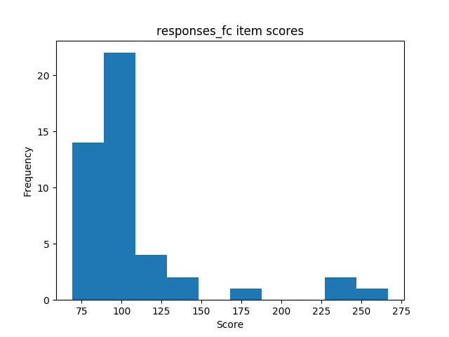
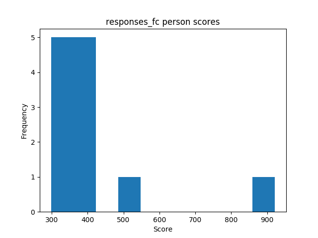
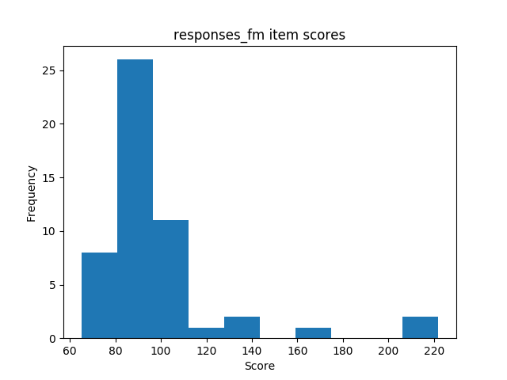
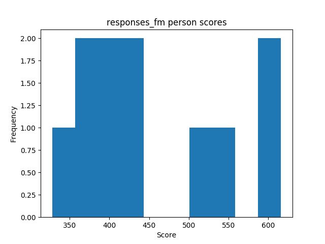
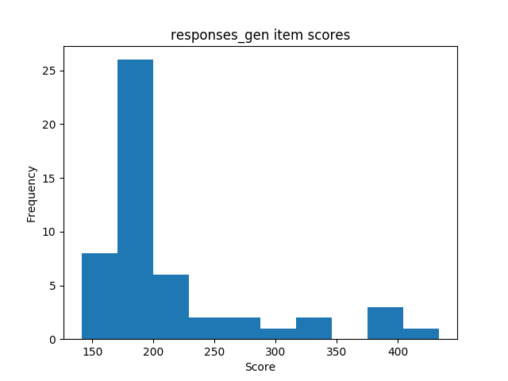
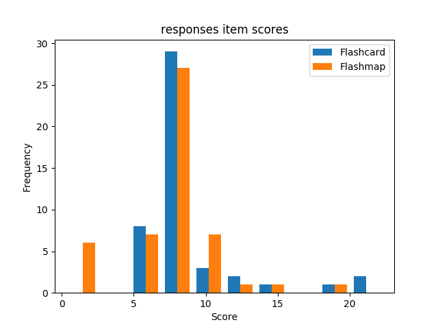
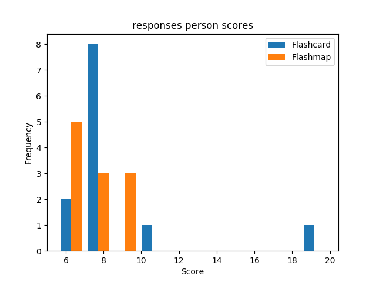

## Descriptives
### Amount of responses
#### Flashcard conditions

| | sample | min | max | mean | variance | skew | kurtosis | normal-t | normal-p | $\alpha$ |
|---|---:|---:|---:|---:|---:|---:|---:|---:|---:|---:|
| **abs** | 12 |  298 |  922 |  409.08 |  28856.81 |  2.54 |  5.30 |  26.830 |  0.0000 |  0.8567 |
| **rel** | 12 |  24 |  76 |  34.09 |  200.39 |  2.54 |  5.30 |  26.830 |  0.0000 |  0.8567 |

#### Flashmap conditions

| | sample | min | max | mean | variance | skew | kurtosis | normal-t | normal-p | $\alpha$ |
|---|---:|---:|---:|---:|---:|---:|---:|---:|---:|---:|
| **abs** | 11 |  328 |  616 |  453.82 |  9703.16 |  0.52 | -1.09 |  1.517 |  0.4684 |  0.7648 |
| **rel** | 11 |  29 |  56 |  41.26 |  80.19 |  0.52 | -1.09 |  1.517 |  0.4684 |  0.7648 |

#### Combined conditions

| | sample | min | max | mean | variance | skew | kurtosis | normal-t | normal-p | $\alpha$ |
|---|---:|---:|---:|---:|---:|---:|---:|---:|---:|---:|
| **abs** | 23 |  328 |  1235 |  476.70 |  34523.13 |  3.11 |  10.29 |  40.938 |  0.0000 |  0.8734 |
| **rel** | 23 |  14 |  53 |  20.73 |  65.26 |  3.11 |  10.29 |  40.938 |  0.0000 |  0.8734 |

## Comparisons
### Amount of responses

| | **Mann-Whitney-U k** | **Mann-Whitney-U p** | **Welch's t-test k** | **Welch's t-test p** |
|---|---:|---:|---:|---:|
| **abs** | -0.763 |  0.4540 | -0.780 |  0.4454 |
| **rel** | -1.435 |  0.1661 | -1.463 |  0.1600 |

