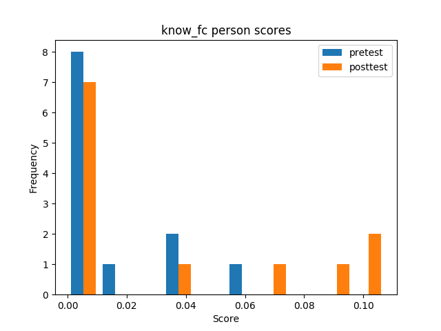
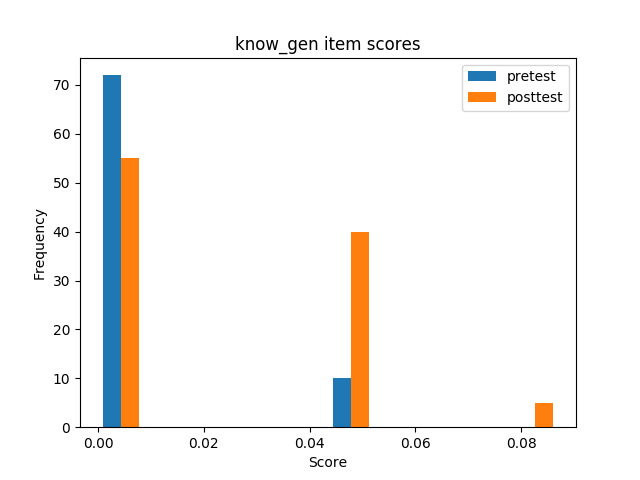
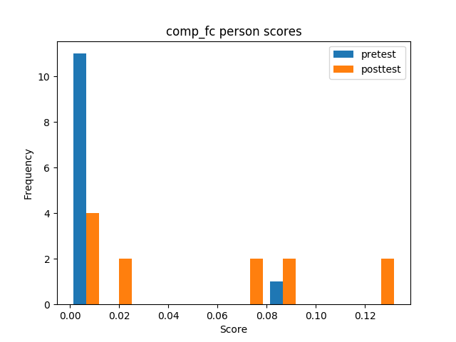
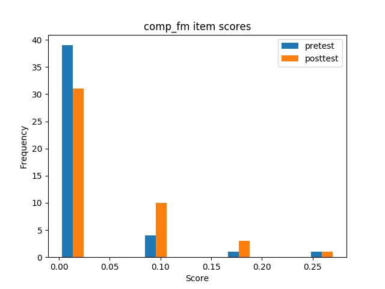
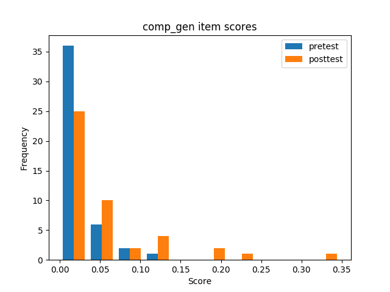
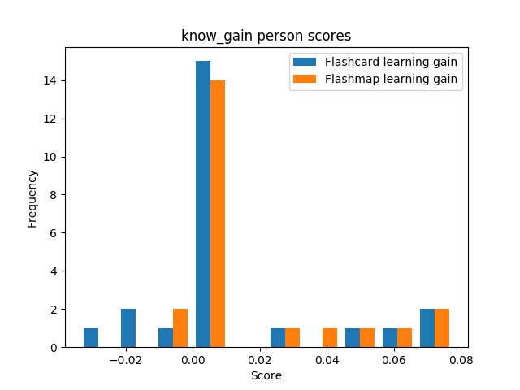

## Descriptives
### Knowledge questions
#### Flashcard conditions

| | sample | min | max | mean | variance | skew | kurtosis | normal-t | normal-p | $\alpha$ |
|---|---:|---:|---:|---:|---:|---:|---:|---:|---:|---:|
| **ctt:total** | 24 |  0 |  6 |  1.29 |  4.13 |  1.34 |  0.40 |  8.732 |  0.0127 |  0.6958 |
| **ctt:pretest** | 12 |  0 |  3 |  0.67 |  1.15 |  1.16 | -0.19 |  4.546 |  0.1030 |  0.4290 |
| **ctt:posttest** | 12 |  0 |  6 |  1.92 |  6.63 |  0.70 | -1.29 |  3.371 |  0.1854 |  0.7261 |
| **ctt:abs_learn_gain** | 12 | -3 |  6 |  1.25 |  8.39 |  0.47 | -0.84 |  0.900 |  0.6378 |  0.4290 |
| **ctt:rel_learn_gain** | 12 |  0 |  0 |  0.04 |  0.00 |  0.43 | -0.86 |  0.810 |  0.6671 |  0.4290 |
| **irt:total** | 24 | -1 |  4 | -0.03 |  3.05 |  1.05 |  0.04 |  5.537 |  0.0627 |  0.4556 |
| **irt:pretest** | 12 |  0 |  0 |  0.00 |  0.08 |  0.62 |  0.07 |  2.059 |  0.3573 |  0.0687 |
| **irt:posttest** | 12 | -2 |  3 | -0.01 |  2.70 |  0.61 |  0.63 |  3.146 |  0.2074 |  0.3769 |
| **irt:abs_learn_gain** | 12 | -2 |  3 | -0.01 |  2.87 |  0.91 |  0.61 |  4.553 |  0.1026 |  0.0687 |
| **irt:rel_learn_gain** | 12 |  0 |  0 |  0.02 |  0.00 |  0.90 |  0.59 |  4.487 |  0.1061 |  0.0687 |
| **adjusted irt:total** | 24 | -4 |  3 | -0.83 |  4.14 |  0.58 | -0.36 |  1.812 |  0.4042 |  0.5294 |
| **adjusted irt:pretest** | 12 |  1 |  3 |  2.60 |  0.17 |  0.43 |  0.39 |  2.010 |  0.3661 |  0.1088 |
| **adjusted irt:posttest** | 12 | -2 |  3 | -0.07 |  2.71 |  0.61 |  0.63 |  3.188 |  0.2031 |  0.3774 |
| **adjusted irt:abs_learn_gain** | 12 | -4 |  1 | -2.67 |  2.91 |  1.01 |  0.64 |  5.199 |  0.0743 |  0.1088 |
| **adjusted irt:rel_learn_gain** | 12 |  0 |  0 | -0.03 |  0.00 |  1.01 |  0.62 |  5.132 |  0.0769 |  0.1088 |

#### Flashmap conditions

| | sample | min | max | mean | variance | skew | kurtosis | normal-t | normal-p | $\alpha$ |
|---|---:|---:|---:|---:|---:|---:|---:|---:|---:|---:|
| **ctt:total** | 22 |  0 |  7 |  1.32 |  4.89 |  1.48 |  0.77 |  10.348 |  0.0057 |  0.7424 |
| **ctt:pretest** | 11 |  0 |  1 |  0.18 |  0.16 |  1.65 |  0.72 |  9.711 |  0.0078 | -0.1132 |
| **ctt:posttest** | 11 |  0 |  7 |  2.45 |  7.27 |  0.45 | -1.31 |  2.304 |  0.3160 |  0.6841 |
| **ctt:abs_learn_gain** | 11 | -1 |  7 |  2.27 |  7.42 |  0.45 | -1.14 |  1.448 |  0.4848 | -0.1132 |
| **ctt:rel_learn_gain** | 11 |  0 |  0 |  0.05 |  0.00 |  0.44 | -1.15 |  1.490 |  0.4747 | -0.1132 |
| **irt:total** | 22 | -2 |  4 | -0.03 |  3.02 |  0.62 |  0.46 |  3.124 |  0.2097 |  0.3942 |
| **irt:pretest** | 11 |  0 |  0 | -0.00 |  0.00 |  1.65 |  0.72 |  9.711 |  0.0078 |  0.0000 |
| **irt:posttest** | 11 | -1 |  1 | -0.00 |  0.76 | -0.00 |  2.50 |  6.534 |  0.0381 |  0.1362 |
| **irt:abs_learn_gain** | 11 | -1 |  1 | -0.00 |  0.76 | -0.00 |  2.50 |  6.534 |  0.0381 |  0.0000 |
| **irt:rel_learn_gain** | 11 |  0 |  0 |  0.02 |  0.00 |  0.00 |  2.50 |  7.592 |  0.0225 |  0.0000 |
| **adjusted irt:total** | 22 | -4 |  3 | -0.80 |  3.94 |  0.17 |  0.04 |  0.556 |  0.7575 |  0.4530 |
| **adjusted irt:pretest** | 11 |  0 |  0 |  0.11 |  0.00 |  0.00 | -3.00 |  1.057 |  0.5894 |  0.0000 |
| **adjusted irt:posttest** | 11 |  2 |  4 |  3.27 |  0.15 | -0.02 |  2.44 |  6.403 |  0.0407 |  0.1020 |
| **adjusted irt:abs_learn_gain** | 11 |  2 |  4 |  3.17 |  0.15 | -0.02 |  2.44 |  6.403 |  0.0407 |  0.0000 |
| **adjusted irt:rel_learn_gain** | 11 |  0 |  0 |  0.07 |  0.00 | -0.02 |  2.44 |  6.403 |  0.0407 |  0.0000 |

#### General

| | sample | min | max | mean | variance | skew | kurtosis | normal-t | normal-p | $\alpha$ |
|---|---:|---:|---:|---:|---:|---:|---:|---:|---:|---:|
| **ctt:total** | 46 |  0 |  7 |  1.30 |  4.39 |  1.42 |  0.64 |  14.471 |  0.0007 |  0.7112 |
| **ctt:pretest** | 23 |  0 |  3 |  0.43 |  0.71 |  1.83 |  2.28 |  17.317 |  0.0002 |  0.3937 |
| **ctt:posttest** | 23 |  0 |  7 |  2.17 |  6.70 |  0.58 | -1.30 |  6.839 |  0.0327 |  0.6851 |
| **ctt:abs_learn_gain** | 23 | -3 |  7 |  1.74 |  7.84 |  0.40 | -0.93 |  2.023 |  0.3637 |  0.3937 |
| **ctt:rel_learn_gain** | 23 |  0 |  0 |  0.03 |  0.00 |  0.39 | -0.93 |  1.977 |  0.3722 |  0.3937 |
| **irt:total** | 46 | -3 |  5 | -0.10 |  4.92 |  0.98 | -0.23 |  7.303 |  0.0259 |  0.5856 |
| **irt:pretest** | 23 | -2 |  2 | -0.00 |  1.22 |  0.97 |  2.19 |  9.614 |  0.0082 |  0.2141 |
| **irt:posttest** | 23 | -3 |  3 | -0.02 |  3.68 |  0.87 | -0.19 |  3.757 |  0.1528 |  0.4740 |
| **irt:abs_learn_gain** | 23 | -4 |  4 | -0.02 |  5.31 |  0.42 | -0.29 |  0.967 |  0.6166 |  0.2141 |
| **irt:rel_learn_gain** | 23 |  0 |  0 |  0.01 |  0.00 |  0.38 | -0.27 |  0.833 |  0.6592 |  0.2141 |
| **adjusted irt:total** | 46 | -5 |  3 | -1.85 |  5.68 |  0.80 | -0.29 |  5.224 |  0.0734 |  0.6710 |
| **adjusted irt:pretest** | 23 | -2 |  2 | -0.01 |  1.22 |  0.98 |  2.19 |  9.677 |  0.0079 |  0.2142 |
| **adjusted irt:posttest** | 23 | -4 |  3 | -0.88 |  5.74 |  0.31 | -0.53 |  0.564 |  0.7541 |  0.5859 |
| **adjusted irt:abs_learn_gain** | 23 | -7 |  4 | -0.88 |  8.23 | -0.21 |  0.11 |  0.742 |  0.6900 |  0.2142 |
| **adjusted irt:rel_learn_gain** | 23 |  0 |  0 |  0.00 |  0.00 | -0.26 |  0.19 |  1.015 |  0.6019 |  0.2142 |

### Comprehension questions
#### Flashcard conditions

| | sample | min | max | mean | variance | skew | kurtosis | normal-t | normal-p | $\alpha$ |
|---|---:|---:|---:|---:|---:|---:|---:|---:|---:|---:|
| **ctt:total** | 24 |  0 |  6 |  1.33 |  4.23 |  1.19 | -0.05 |  6.646 |  0.0361 |  0.7215 |
| **ctt:pretest** | 12 |  0 |  4 |  0.33 |  1.33 |  3.02 |  7.09 |  33.648 |  0.0000 |  0.7670 |
| **ctt:posttest** | 12 |  0 |  6 |  2.33 |  5.33 |  0.41 | -1.25 |  2.077 |  0.3540 |  0.6450 |
| **ctt:abs_learn_gain** | 12 |  0 |  6 |  2.00 |  5.45 |  0.72 | -0.96 |  2.091 |  0.3516 |  0.6450 |
| **ctt:rel_learn_gain** | 12 |  0 |  0 |  0.07 |  0.00 |  0.72 | -0.95 |  2.097 |  0.3504 |  0.6450 |
| **irt:total** | 24 | -2 |  4 |  0.05 |  4.71 |  0.80 | -0.83 |  4.030 |  0.1333 |  0.6583 |
| **irt:pretest** | 12 | -1 |  4 | -0.09 |  2.62 |  2.47 |  5.19 |  26.077 |  0.0000 |  0.3406 |
| **irt:posttest** | 12 | -2 |  2 |  0.01 |  3.51 |  0.00 | -1.31 |  1.869 |  0.3929 |  0.7510 |
| **irt:abs_learn_gain** | 12 | -3 |  3 |  0.10 |  5.54 | -0.07 | -1.19 |  1.211 |  0.5459 |  0.3406 |
| **irt:rel_learn_gain** | 12 |  0 |  0 |  0.02 |  0.00 | -0.15 | -1.11 |  0.886 |  0.6420 |  0.3406 |
| **adjusted irt:total** | 24 | -3 |  3 | -1.15 |  3.83 |  0.90 | -0.52 |  4.058 |  0.1315 |  0.6673 |
| **adjusted irt:pretest** | 12 |  0 |  5 |  0.42 |  2.58 |  2.72 |  6.04 |  29.551 |  0.0000 |  0.3207 |
| **adjusted irt:posttest** | 12 | -3 |  1 | -0.87 |  3.16 |  0.03 | -1.30 |  1.835 |  0.3994 |  0.7480 |
| **adjusted irt:abs_learn_gain** | 12 | -5 |  2 | -1.28 |  5.01 | -0.15 | -1.04 |  0.652 |  0.7218 |  0.3207 |
| **adjusted irt:rel_learn_gain** | 12 |  0 |  0 | -0.01 |  0.00 | -0.29 | -0.81 |  0.411 |  0.8142 |  0.3207 |

### Flashmap conditions

| | sample | min | max | mean | variance | skew | kurtosis | normal-t | normal-p | $\alpha$ |
|---|---:|---:|---:|---:|---:|---:|---:|---:|---:|---:|
| **ctt:total** | 22 |  0 |  8 |  1.27 |  3.92 |  2.06 |  4.13 |  22.828 |  0.0000 |  0.7202 |
| **ctt:pretest** | 11 |  0 |  4 |  0.82 |  1.56 |  1.64 |  1.82 |  12.332 |  0.0021 |  0.5351 |
| **ctt:posttest** | 11 |  0 |  8 |  1.73 |  6.22 |  1.58 |  1.62 |  11.397 |  0.0034 |  0.7566 |
| **ctt:abs_learn_gain** | 11 | -1 |  4 |  0.91 |  2.89 |  1.04 | -0.35 |  3.526 |  0.1715 |  0.5351 |
| **ctt:rel_learn_gain** | 11 |  0 |  0 |  0.04 |  0.00 |  1.09 | -0.23 |  3.961 |  0.1380 |  0.5351 |
| **irt:total** | 22 | -1 |  3 |  0.01 |  2.83 |  0.65 | -1.02 |  3.743 |  0.1539 |  0.6260 |
| **irt:pretest** | 11 | -1 |  3 | -0.00 |  2.98 |  0.91 | -0.34 |  2.786 |  0.2483 |  0.5317 |
| **irt:posttest** | 11 | -2 |  2 |  0.01 |  3.41 |  0.19 | -1.62 |  4.801 |  0.0907 |  0.6901 |
| **irt:abs_learn_gain** | 11 | -1 |  2 |  0.01 |  1.71 |  1.00 | -0.12 |  3.564 |  0.1683 |  0.5317 |
| **irt:rel_learn_gain** | 11 |  0 |  0 |  0.02 |  0.00 |  0.99 | -0.11 |  3.521 |  0.1720 |  0.5317 |
| **adjusted irt:total** | 22 | -1 |  3 |  0.05 |  2.92 |  0.66 | -1.01 |  3.727 |  0.1551 |  0.6277 |
| **adjusted irt:pretest** | 11 |  0 |  4 |  1.54 |  2.10 |  0.93 | -0.32 |  2.893 |  0.2354 |  0.4888 |
| **adjusted irt:posttest** | 11 | -1 |  3 |  0.57 |  3.81 |  0.15 | -1.64 |  5.133 |  0.0768 |  0.6957 |
| **adjusted irt:abs_learn_gain** | 11 | -2 |  1 | -0.97 |  1.88 |  1.08 |  0.01 |  4.284 |  0.1174 |  0.4888 |
| **adjusted irt:rel_learn_gain** | 11 |  0 |  0 |  0.00 |  0.00 |  1.08 |  0.01 |  4.277 |  0.1178 |  0.4888 |

### General

| | sample | min | max | mean | variance | skew | kurtosis | normal-t | normal-p | $\alpha$ |
|---|---:|---:|---:|---:|---:|---:|---:|---:|---:|---:|
| **ctt:total** | 46 |  0 |  8 |  1.30 |  3.99 |  1.58 |  1.77 |  19.890 |  0.0000 |  0.7140 |
| **ctt:pretest** | 23 |  0 |  4 |  0.57 |  1.44 |  2.19 |  3.53 |  23.159 |  0.0000 |  0.6350 |
| **ctt:posttest** | 23 |  0 |  8 |  2.04 |  5.59 |  0.98 | -0.02 |  4.808 |  0.0903 |  0.6951 |
| **ctt:abs_learn_gain** | 23 | -1 |  6 |  1.48 |  4.35 |  0.97 | -0.34 |  4.419 |  0.1097 |  0.6350 |
| **ctt:rel_learn_gain** | 23 |  0 |  0 |  0.05 |  0.00 |  0.95 | -0.42 |  4.277 |  0.1178 |  0.6350 |
| **irt:total** | 46 | -1 |  3 |  0.00 |  2.33 |  0.81 | -0.90 |  8.324 |  0.0156 |  0.6015 |
| **irt:pretest** | 23 | -1 |  4 |  0.01 |  2.56 |  1.65 |  1.53 |  13.943 |  0.0009 |  0.4629 |
| **irt:posttest** | 23 | -1 |  2 |  0.00 |  2.04 |  0.19 | -1.52 |  11.285 |  0.0035 |  0.6781 |
| **irt:abs_learn_gain** | 23 | -3 |  3 | -0.01 |  2.86 |  0.32 | -0.85 |  1.311 |  0.5192 |  0.4629 |
| **irt:rel_learn_gain** | 23 |  0 |  0 |  0.02 |  0.00 |  0.24 | -0.77 |  0.786 |  0.6749 |  0.4629 |
| **adjusted irt:total** | 46 | -2 |  2 | -0.62 |  2.30 |  0.82 | -0.86 |  8.005 |  0.0183 |  0.6058 |
| **adjusted irt:pretest** | 23 | -1 |  4 |  0.04 |  2.52 |  1.66 |  1.54 |  13.979 |  0.0009 |  0.4618 |
| **adjusted irt:posttest** | 23 | -1 |  2 | -0.23 |  1.97 |  0.17 | -1.56 |  12.676 |  0.0018 |  0.6732 |
| **adjusted irt:abs_learn_gain** | 23 | -3 |  2 | -0.26 |  2.85 |  0.27 | -0.87 |  1.246 |  0.5362 |  0.4618 |
| **adjusted irt:rel_learn_gain** | 23 |  0 |  0 |  0.02 |  0.00 |  0.18 | -0.76 |  0.640 |  0.7262 |  0.4618 |

## Comparisons
### Knowledge questions
#### Between pre- and posttest
##### Flashcard condition

| | **Mann-Whitney-U k** | **Mann-Whitney-U p** | **Welch's t-test k** | **Welch's t-test p** |
|---|---:|---:|---:|---:|
| **ctt** | -1.552 |  0.1348 | -1.552 |  0.1418 |
| **irt** |  0.016 |  0.9872 |  0.016 |  0.9873 |
| **adjusted irt** |  5.454 |  0.0000 |  5.454 |  0.0001 |

##### Flashmap condition

| | **Mann-Whitney-U k** | **Mann-Whitney-U p** | **Welch's t-test k** | **Welch's t-test p** |
|---|---:|---:|---:|---:|
| **ctt** | -2.764 |  0.0120 | -2.764 |  0.0192 |
| **irt** | -0.000 |  1.0000 | -0.000 |  1.0000 |
| **adjusted irt** | -27.206 |  0.0000 | -27.206 |  0.0000 |

##### Combined

| | **Mann-Whitney-U k** | **Mann-Whitney-U p** | **Welch's t-test k** | **Welch's t-test p** |
|---|---:|---:|---:|---:|
| **ctt** | -3.065 |  0.0037 | -3.065 |  0.0049 |
| **irt** |  0.051 |  0.9597 |  0.051 |  0.9598 |
| **adjusted irt** |  1.591 |  0.1187 |  1.591 |  0.1217 |

#### Between conditions
##### ctt

| | **Mann-Whitney-U k** | **Mann-Whitney-U p** | **Welch's t-test k** | **Welch's t-test p** |
|---|---:|---:|---:|---:|
| **total** | -0.042 |  0.9664 | -0.042 |  0.9665 |
| **pretest** |  1.407 |  0.1739 |  1.456 |  0.1669 |
| **posttest** | -0.489 |  0.6297 | -0.488 |  0.6305 |
| **abs_learn_gain** | -0.870 |  0.3940 | -0.873 |  0.3927 |
| **rel_learn_gain** | -0.747 |  0.4635 | -0.751 |  0.4611 |

##### irt

| | **Mann-Whitney-U k** | **Mann-Whitney-U p** | **Welch's t-test k** | **Welch's t-test p** |
|---|---:|---:|---:|---:|
| **total** | -0.001 |  0.9989 | -0.001 |  0.9989 |
| **pretest** |  0.000 |  1.0000 |  0.000 |  1.0000 |
| **posttest** | -0.014 |  0.9889 | -0.014 |  0.9887 |
| **abs_learn_gain** | -0.014 |  0.9892 | -0.014 |  0.9889 |
| **rel_learn_gain** |  0.072 |  0.9436 |  0.074 |  0.9423 |

##### adjusted irt

| | **Mann-Whitney-U k** | **Mann-Whitney-U p** | **Welch's t-test k** | **Welch's t-test p** |
|---|---:|---:|---:|---:|
| **total** | -0.050 |  0.9602 | -0.050 |  0.9602 |
| **pretest** |  20.261 |  0.0000 |  21.204 |  0.0000 |
| **posttest** | -6.549 |  0.0000 | -6.821 |  0.0000 |
| **abs_learn_gain** | -11.067 |  0.0000 | -11.531 |  0.0000 |
| **rel_learn_gain** | -10.401 |  0.0000 | -10.845 |  0.0000 |

### Comprehension questions
#### Between pre- and posttest
##### Flashcard condition

| | **Mann-Whitney-U k** | **Mann-Whitney-U p** | **Welch's t-test k** | **Welch's t-test p** |
|---|---:|---:|---:|---:|
| **ctt** | -2.683 |  0.0136 | -2.683 |  0.0162 |
| **irt** | -0.146 |  0.8852 | -0.146 |  0.8852 |
| **adjusted irt** |  1.856 |  0.0768 |  1.856 |  0.0770 |

##### Flashmap condition

| | **Mann-Whitney-U k** | **Mann-Whitney-U p** | **Welch's t-test k** | **Welch's t-test p** |
|---|---:|---:|---:|---:|
| **ctt** | -1.081 |  0.2926 | -1.081 |  0.2971 |
| **irt** | -0.018 |  0.9854 | -0.018 |  0.9854 |
| **adjusted irt** |  1.318 |  0.2024 |  1.318 |  0.2036 |

##### Combined

| | **Mann-Whitney-U k** | **Mann-Whitney-U p** | **Welch's t-test k** | **Welch's t-test p** |
|---|---:|---:|---:|---:|
| **ctt** | -2.674 |  0.0105 | -2.674 |  0.0116 |
| **irt** |  0.023 |  0.9818 |  0.023 |  0.9818 |
| **adjusted irt** |  0.595 |  0.5549 |  0.595 |  0.5549 |

#### Between conditions
##### ctt

| | **Mann-Whitney-U k** | **Mann-Whitney-U p** | **Welch's t-test k** | **Welch's t-test p** |
|---|---:|---:|---:|---:|
| **total** |  0.102 |  0.9195 |  0.102 |  0.9194 |
| **pretest** | -0.967 |  0.3446 | -0.963 |  0.3466 |
| **posttest** |  0.605 |  0.5515 |  0.603 |  0.5531 |
| **abs_learn_gain** |  1.270 |  0.2179 |  1.288 |  0.2124 |
| **rel_learn_gain** |  1.197 |  0.2448 |  1.211 |  0.2399 |

##### irt

| | **Mann-Whitney-U k** | **Mann-Whitney-U p** | **Welch's t-test k** | **Welch's t-test p** |
|---|---:|---:|---:|---:|
| **total** |  0.071 |  0.9436 |  0.072 |  0.9430 |
| **pretest** | -0.132 |  0.8961 | -0.132 |  0.8965 |
| **posttest** | -0.002 |  0.9982 | -0.002 |  0.9982 |
| **abs_learn_gain** |  0.112 |  0.9116 |  0.115 |  0.9097 |
| **rel_learn_gain** |  0.064 |  0.9496 |  0.066 |  0.9484 |

##### adjusted irt

| | **Mann-Whitney-U k** | **Mann-Whitney-U p** | **Welch's t-test k** | **Welch's t-test p** |
|---|---:|---:|---:|---:|
| **total** | -2.188 |  0.0340 | -2.202 |  0.0330 |
| **pretest** | -1.748 |  0.0950 | -1.756 |  0.0936 |
| **posttest** | -1.849 |  0.0785 | -1.842 |  0.0802 |
| **abs_learn_gain** | -0.407 |  0.6882 | -0.415 |  0.6826 |
| **rel_learn_gain** | -0.455 |  0.6537 | -0.465 |  0.6476 |

