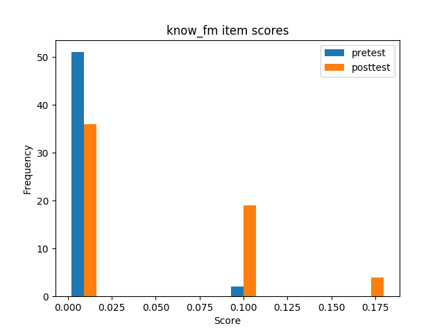

## Descriptives
### Knowledge questions
#### Flashcard conditions

| | sample | min | max | mean | variance | skew | kurtosis | normal-t | normal-p | $\alpha$ |
|---|---:|---:|---:|---:|---:|---:|---:|---:|---:|---:|
| **ctt:total** | 24 |  0 |  6 |  0.58 |  2.51 |  2.72 |  5.95 |  32.564 |  0.0000 |  0.7517 |
| **ctt:pretest** | 12 |  0 |  0 |  0.00 |  0.00 |  0.00 | -3.00 |  1.064 |  0.5875 |    nan |
| **ctt:posttest** | 12 |  0 |  6 |  1.17 |  4.52 |  1.55 |  0.78 |  9.207 |  0.0100 |  0.7317 |
| **ctt:abs_learn_gain** | 12 |  0 |  6 |  1.17 |  4.52 |  1.55 |  0.78 |  9.207 |  0.0100 |    nan |
| **ctt:rel_learn_gain** | 12 |  0 |  0 |  0.04 |  0.00 |  1.55 |  0.78 |  9.207 |  0.0100 |    nan |
| **irt:total** | 24 |  0 |  2 | -0.00 |  0.32 |  2.18 |  6.24 |  28.201 |  0.0000 |  0.1604 |
| **irt:posttest** | 12 |  0 |  1 |  0.01 |  0.22 |  1.80 |  3.70 |  17.766 |  0.0001 |  0.1335 |
| **adjusted irt:posttest** | 12 |  2 |  4 |  3.03 |  0.44 |  0.08 | -1.38 |  2.424 |  0.2976 |  0.6751 |

#### Flashmap conditions

| | sample | min | max | mean | variance | skew | kurtosis | normal-t | normal-p | $\alpha$ |
|---|---:|---:|---:|---:|---:|---:|---:|---:|---:|---:|
| **ctt:total** | 22 |  0 |  7 |  0.64 |  2.81 |  2.89 |  7.74 |  35.636 |  0.0000 |  0.6910 |
| **ctt:pretest** | 11 |  0 |  1 |  0.09 |  0.09 |  2.85 |  6.10 |  31.151 |  0.0000 |  0.6751 |
| **ctt:posttest** | 11 |  0 |  7 |  1.18 |  5.16 |  1.75 |  1.88 |  13.315 |  0.0013 |  0.6893 |
| **ctt:abs_learn_gain** | 11 | -1 |  7 |  1.09 |  5.49 |  1.65 |  1.65 |  11.958 |  0.0025 |  0.6751 |
| **ctt:rel_learn_gain** | 11 |  0 |  0 |  0.04 |  0.01 |  1.64 |  1.64 |  11.883 |  0.0026 |  0.6751 |
| **irt:total** | 22 | -1 |  1 | -0.00 |  0.42 |  1.74 |  3.39 |  18.548 |  0.0001 |  0.2067 |
| **irt:pretest** | 11 |  0 |  0 |  0.00 |  0.00 |  2.85 |  6.10 |  31.151 |  0.0000 |  0.0000 |
| **irt:posttest** | 11 |  0 |  0 |  0.01 |  0.11 |  0.22 |  2.50 |  6.692 |  0.0352 |  0.0894 |
| **irt:abs_learn_gain** | 11 |  0 |  0 |  0.01 |  0.11 |  0.23 |  2.50 |  6.701 |  0.0351 |  0.0000 |
| **irt:rel_learn_gain** | 11 |  0 |  0 |  0.00 |  0.00 |  0.23 |  2.50 |  6.701 |  0.0351 |  0.0000 |
| **adjusted irt:pretest** | 11 |  0 |  0 |  0.00 |  0.00 |  2.85 |  6.10 |  31.151 |  0.0000 |  0.0000 |
| **adjusted irt:posttest** | 11 |  0 |  0 |  0.01 |  0.11 |  0.22 |  2.50 |  6.692 |  0.0352 |  0.0894 |
| **adjusted irt:abs_learn_gain** | 11 |  0 |  0 |  0.01 |  0.11 |  0.23 |  2.50 |  6.701 |  0.0351 |  0.0000 |
| **adjusted irt:rel_learn_gain** | 11 |  0 |  0 |  0.00 |  0.00 |  0.23 |  2.50 |  6.701 |  0.0351 |  0.0000 |

#### General

| | sample | min | max | mean | variance | skew | kurtosis | normal-t | normal-p | $\alpha$ |
|---|---:|---:|---:|---:|---:|---:|---:|---:|---:|---:|
| **ctt:total** | 46 |  0 |  7 |  0.61 |  2.60 |  2.81 |  6.95 |  46.580 |  0.0000 |  0.7108 |
| **ctt:pretest** | 23 |  0 |  1 |  0.04 |  0.04 |  4.48 |  18.05 |  57.947 |  0.0000 |  0.7015 |
| **ctt:posttest** | 23 |  0 |  7 |  1.17 |  4.60 |  1.66 |  1.40 |  13.680 |  0.0011 |  0.6853 |
| **ctt:abs_learn_gain** | 23 | -1 |  7 |  1.13 |  4.75 |  1.60 |  1.30 |  12.936 |  0.0016 |  0.6853 |
| **ctt:rel_learn_gain** | 23 |  0 |  0 |  0.02 |  0.00 |  1.60 |  1.29 |  12.912 |  0.0016 |  0.6853 |
| **irt:total** | 46 | -1 |  2 | -0.01 |  0.66 |  1.90 |  4.24 |  30.317 |  0.0000 |  0.2568 |
| **irt:pretest** | 23 |  0 |  0 |  0.00 |  0.00 |  4.48 |  18.05 |  57.947 |  0.0000 |  0.0000 |
| **irt:posttest** | 23 | -1 |  1 |  0.01 |  0.37 |  1.18 |  2.00 |  10.851 |  0.0044 |  0.2123 |
| **irt:abs_learn_gain** | 23 | -1 |  1 |  0.01 |  0.37 |  1.18 |  2.00 |  10.871 |  0.0044 |  0.0000 |
| **irt:rel_learn_gain** | 23 |  0 |  0 |  0.00 |  0.00 |  1.18 |  2.00 |  10.871 |  0.0044 |  0.0000 |
| **adjusted irt:pretest** | 23 |  0 |  0 |  0.00 |  0.00 |  4.48 |  18.05 |  57.947 |  0.0000 |  0.0000 |
| **adjusted irt:posttest** | 23 | -1 |  1 |  0.01 |  0.37 |  1.18 |  2.00 |  10.851 |  0.0044 |  0.2123 |
| **adjusted irt:abs_learn_gain** | 23 | -1 |  1 |  0.01 |  0.37 |  1.18 |  2.00 |  10.871 |  0.0044 |  0.0000 |
| **adjusted irt:rel_learn_gain** | 23 |  0 |  0 |  0.00 |  0.00 |  1.18 |  2.00 |  10.871 |  0.0044 |  0.0000 |

### Comprehension questions
#### Flashcard conditions

| | sample | min | max | mean | variance | skew | kurtosis | normal-t | normal-p | $\alpha$ |
|---|---:|---:|---:|---:|---:|---:|---:|---:|---:|---:|
| **ctt:total** | 24 |  0 |  6 |  1.25 |  3.76 |  1.43 |  0.77 |  10.351 |  0.0057 |  0.5383 |
| **ctt:pretest** | 12 |  0 |  1 |  0.17 |  0.15 |  1.79 |  1.20 |  11.982 |  0.0025 |  0.5119 |
| **ctt:posttest** | 12 |  0 |  6 |  2.33 |  5.15 |  0.45 | -1.14 |  1.615 |  0.4460 |  0.4228 |
| **ctt:abs_learn_gain** | 12 |  0 |  6 |  2.17 |  4.33 |  0.46 | -0.98 |  1.155 |  0.5613 |  0.4228 |
| **ctt:rel_learn_gain** | 12 |  0 |  1 |  0.47 |  0.21 |  0.50 | -1.02 |  1.408 |  0.4947 |  0.4228 |
| **irt:total** | 24 | -1 |  3 | -0.03 |  1.66 |  0.73 | -0.58 |  2.887 |  0.2361 |  0.5549 |
| **irt:pretest** | 12 |  0 |  0 | -0.00 |  0.09 |  1.24 |  0.26 |  5.847 |  0.0537 |  0.0851 |
| **irt:posttest** | 12 | -1 |  2 | -0.02 |  2.22 |  0.25 | -0.99 |  0.661 |  0.7184 |  0.7030 |
| **irt:abs_learn_gain** | 12 | -1 |  2 | -0.02 |  1.84 | -0.00 | -1.22 |  1.323 |  0.5161 |  0.0851 |
| **irt:rel_learn_gain** | 12 |  0 |  0 |  0.00 |  0.08 |  0.10 | -1.08 |  0.745 |  0.6890 |  0.0851 |
| **adjusted irt:pretest** | 12 |  1 |  1 |  1.80 |  0.00 |  0.00 | -3.00 |  1.064 |  0.5875 |  1.0000 |
| **adjusted irt:posttest** | 12 |  1 |  1 |  1.80 |  0.00 |  0.00 | -3.00 |  1.064 |  0.5875 |  1.0000 |
| **adjusted irt:abs_learn_gain** | 12 |  0 |  0 |  0.00 |  0.00 |  0.00 | -3.00 |  1.064 |  0.5875 |  1.0000 |
| **adjusted irt:rel_learn_gain** | 12 |  0 |  0 |  0.00 |  0.00 |  0.00 | -3.00 |  1.064 |  0.5875 |  1.0000 |

#### Flashmap conditions

| | sample | min | max | mean | variance | skew | kurtosis | normal-t | normal-p | $\alpha$ |
|---|---:|---:|---:|---:|---:|---:|---:|---:|---:|---:|
| **ctt:total** | 22 |  0 |  8 |  1.36 |  3.86 |  1.98 |  3.95 |  21.814 |  0.0000 |  0.3966 |
| **ctt:pretest** | 11 |  0 |  4 |  1.00 |  2.00 |  1.11 | -0.14 |  4.216 |  0.1215 |  0.0682 |
| **ctt:posttest** | 11 |  0 |  8 |  1.73 |  5.82 |  1.77 |  2.24 |  14.330 |  0.0008 |  0.5195 |
| **ctt:abs_learn_gain** | 11 | -1 |  4 |  0.73 |  3.22 |  1.08 | -0.33 |  3.780 |  0.1511 |  0.0682 |
| **ctt:rel_learn_gain** | 11 |  0 |  4 |  0.40 |  1.54 |  2.48 |  4.84 |  25.788 |  0.0000 |  0.0682 |
| **irt:total** | 22 |  0 |  1 |  0.01 |  0.59 |  0.54 | -0.78 |  1.935 |  0.3800 |  0.4788 |
| **irt:pretest** | 11 |  0 |  0 |  0.01 |  0.33 |  0.41 | -0.99 |  0.905 |  0.6359 |  0.3288 |
| **irt:posttest** | 11 | -1 |  1 | -0.01 |  1.41 |  0.23 | -1.17 |  1.081 |  0.5824 |  0.6137 |
| **irt:abs_learn_gain** | 11 | -1 |  1 | -0.02 |  0.84 |  0.62 | -0.91 |  1.447 |  0.4852 |  0.3288 |
| **irt:rel_learn_gain** | 11 |  0 |  0 |  0.00 |  0.03 |  0.65 | -0.97 |  1.709 |  0.4255 |  0.3288 |
| **adjusted irt:pretest** | 11 |  0 |  0 |  0.01 |  0.33 |  0.41 | -0.99 |  0.905 |  0.6359 |  0.3288 |
| **adjusted irt:posttest** | 11 | -1 |  1 | -0.01 |  1.41 |  0.23 | -1.17 |  1.081 |  0.5824 |  0.6137 |
| **adjusted irt:abs_learn_gain** | 11 | -1 |  1 | -0.02 |  0.84 |  0.62 | -0.91 |  1.447 |  0.4852 |  0.3288 |
| **adjusted irt:rel_learn_gain** | 11 |  0 |  0 |  0.00 |  0.03 |  0.65 | -0.97 |  1.709 |  0.4255 |  0.3288 |

#### General

| | sample | min | max | mean | variance | skew | kurtosis | normal-t | normal-p | $\alpha$ |
|---|---:|---:|---:|---:|---:|---:|---:|---:|---:|---:|
| **ctt:total** | 46 |  0 |  8 |  1.30 |  3.73 |  1.70 |  2.36 |  23.060 |  0.0000 |  0.4546 |
| **ctt:pretest** | 23 |  0 |  4 |  0.57 |  1.17 |  2.04 |  3.30 |  21.414 |  0.0000 |  0.1695 |
| **ctt:posttest** | 23 |  0 |  8 |  2.04 |  5.32 |  1.08 |  0.26 |  6.092 |  0.0476 |  0.4229 |
| **ctt:abs_learn_gain** | 23 | -1 |  6 |  1.48 |  4.17 |  0.70 | -0.74 |  2.902 |  0.2343 |  0.1695 |
| **ctt:rel_learn_gain** | 23 |  0 |  4 |  0.43 |  0.81 |  2.84 |  8.96 |  37.249 |  0.0000 |  0.1695 |
| **irt:total** | 46 |  0 |  1 |  0.01 |  0.45 |  0.82 | -0.41 |  5.552 |  0.0623 |  0.4416 |
| **irt:pretest** | 23 |  0 |  1 |  0.00 |  0.38 |  1.25 |  0.58 |  8.145 |  0.0170 |  0.2946 |
| **irt:posttest** | 23 |  0 |  1 |  0.01 |  0.43 |  0.30 | -1.09 |  2.830 |  0.2429 |  0.5119 |
| **irt:abs_learn_gain** | 23 | -1 |  0 |  0.01 |  0.43 |  0.01 | -1.20 |  3.545 |  0.1699 |  0.2946 |
| **irt:rel_learn_gain** | 23 |  0 |  0 | -0.01 |  0.02 | -0.36 | -0.47 |  0.739 |  0.6912 |  0.2946 |
| **adjusted irt:pretest** | 23 |  0 |  1 |  0.00 |  0.38 |  1.25 |  0.58 |  8.145 |  0.0170 |  0.2946 |
| **adjusted irt:posttest** | 23 |  0 |  1 |  0.01 |  0.43 |  0.30 | -1.09 |  2.830 |  0.2429 |  0.5119 |
| **adjusted irt:abs_learn_gain** | 23 | -1 |  0 |  0.01 |  0.43 |  0.01 | -1.20 |  3.545 |  0.1699 |  0.2946 |
| **adjusted irt:rel_learn_gain** | 23 |  0 |  0 | -0.01 |  0.02 | -0.36 | -0.47 |  0.739 |  0.6912 |  0.2946 |

## Comparisons
### Knowledge questions
#### Between pre- and posttest
##### Flashcard condition

| | **Mann-Whitney-U k** | **Mann-Whitney-U p** | **Welch's t-test k** | **Welch's t-test p** |
|---|---:|---:|---:|---:|
| **ctt** | -1.902 |  0.0704 | -1.902 |  0.0837 |

##### Flashmap condition

| | **Mann-Whitney-U k** | **Mann-Whitney-U p** | **Welch's t-test k** | **Welch's t-test p** |
|---|---:|---:|---:|---:|
| **ctt** | -1.578 |  0.1302 | -1.578 |  0.1445 |
| **irt** | -0.101 |  0.9206 | -0.101 |  0.9216 |
| **adjusted irt** | -0.101 |  0.9206 | -0.101 |  0.9216 |

##### Combined

| | **Mann-Whitney-U k** | **Mann-Whitney-U p** | **Welch's t-test k** | **Welch's t-test p** |
|---|---:|---:|---:|---:|
| **ctt** | -2.515 |  0.0156 | -2.515 |  0.0196 |
| **irt** | -0.072 |  0.9430 | -0.072 |  0.9433 |
| **adjusted irt** | -0.072 |  0.9430 | -0.072 |  0.9433 |

#### Between conditions
##### ctt

| | **Mann-Whitney-U k** | **Mann-Whitney-U p** | **Welch's t-test k** | **Welch's t-test p** |
|---|---:|---:|---:|---:|
| **total** | -0.110 |  0.9127 | -0.110 |  0.9130 |
| **pretest** | -1.047 |  0.3071 | -1.000 |  0.3409 |
| **posttest** | -0.017 |  0.9870 | -0.016 |  0.9870 |
| **abs_learn_gain** |  0.081 |  0.9360 |  0.081 |  0.9363 |
| **rel_learn_gain** |  0.004 |  0.9967 |  0.004 |  0.9968 |

##### irt

| | **Mann-Whitney-U k** | **Mann-Whitney-U p** | **Welch's t-test k** | **Welch's t-test p** |
|---|---:|---:|---:|---:|
| **total** |  0.001 |  0.9993 |  0.001 |  0.9993 |
| **posttest** | -0.003 |  0.9976 | -0.003 |  0.9976 |

##### adjusted irt

| | **Mann-Whitney-U k** | **Mann-Whitney-U p** | **Welch's t-test k** | **Welch's t-test p** |
|---|---:|---:|---:|---:|
| **posttest** |  13.573 |  0.0000 |  13.940 |  0.0000 |

### Comprehension questions
#### Between pre- and posttest
##### Flashcard condition

| | **Mann-Whitney-U k** | **Mann-Whitney-U p** | **Welch's t-test k** | **Welch's t-test p** |
|---|---:|---:|---:|---:|
| **ctt** | -3.259 |  0.0036 | -3.259 |  0.0071 |
| **irt** |  0.047 |  0.9627 |  0.047 |  0.9631 |
| **adjusted irt** |    nan |    nan |    nan |    nan |

##### Flashmap condition

| | **Mann-Whitney-U k** | **Mann-Whitney-U p** | **Welch's t-test k** | **Welch's t-test p** |
|---|---:|---:|---:|---:|
| **ctt** | -0.863 |  0.3985 | -0.863 |  0.4010 |
| **irt** |  0.043 |  0.9664 |  0.043 |  0.9665 |
| **adjusted irt** |  0.043 |  0.9664 |  0.043 |  0.9665 |

##### Combined

| | **Mann-Whitney-U k** | **Mann-Whitney-U p** | **Welch's t-test k** | **Welch's t-test p** |
|---|---:|---:|---:|---:|
| **ctt** | -2.785 |  0.0079 | -2.785 |  0.0090 |
| **irt** | -0.042 |  0.9670 | -0.042 |  0.9670 |
| **adjusted irt** | -0.042 |  0.9670 | -0.042 |  0.9670 |

#### Between conditions
##### ctt

| | **Mann-Whitney-U k** | **Mann-Whitney-U p** | **Welch's t-test k** | **Welch's t-test p** |
|---|---:|---:|---:|---:|
| **total** | -0.197 |  0.8445 | -0.197 |  0.8446 |
| **pretest** | -1.965 |  0.0627 | -1.890 |  0.0845 |
| **posttest** |  0.621 |  0.5414 |  0.619 |  0.5426 |
| **abs_learn_gain** |  1.768 |  0.0915 |  1.780 |  0.0895 |
| **rel_learn_gain** |  0.182 |  0.8576 |  0.175 |  0.8635 |

##### irt

| | **Mann-Whitney-U k** | **Mann-Whitney-U p** | **Welch's t-test k** | **Welch's t-test p** |
|---|---:|---:|---:|---:|
| **total** | -0.141 |  0.8884 | -0.144 |  0.8862 |
| **pretest** | -0.027 |  0.9788 | -0.026 |  0.9794 |
| **posttest** | -0.016 |  0.9877 | -0.016 |  0.9876 |
| **abs_learn_gain** | -0.008 |  0.9939 | -0.008 |  0.9938 |
| **rel_learn_gain** |  0.012 |  0.9907 |  0.012 |  0.9906 |

##### adjusted irt

| | **Mann-Whitney-U k** | **Mann-Whitney-U p** | **Welch's t-test k** | **Welch's t-test p** |
|---|---:|---:|---:|---:|
| **pretest** |  10.886 |  0.0000 |  10.400 |  0.0000 |
| **posttest** |  5.291 |  0.0000 |  5.055 |  0.0005 |
| **abs_learn_gain** |  0.064 |  0.9494 |  0.061 |  0.9523 |
| **rel_learn_gain** | -0.011 |  0.9911 | -0.011 |  0.9916 |

