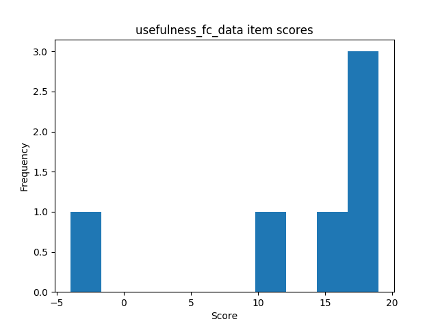
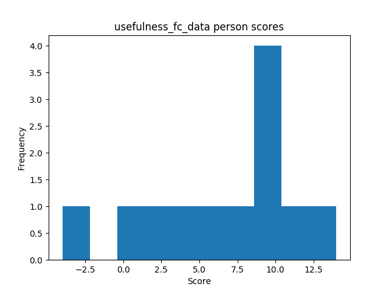
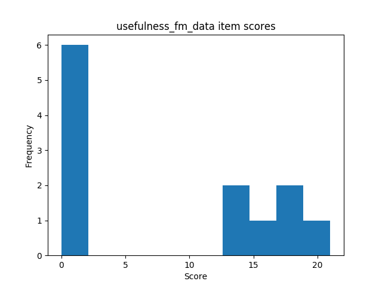
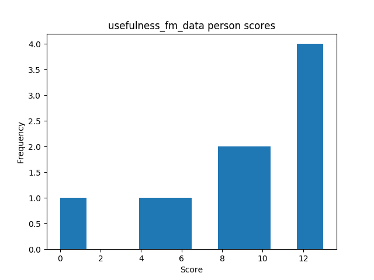
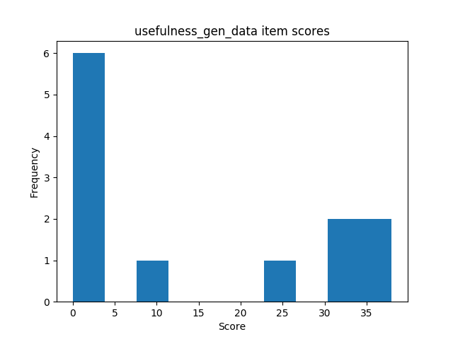
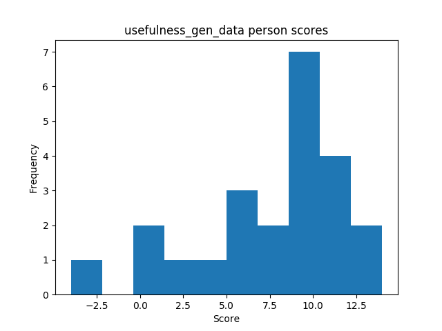

## Reliability
### Usefulness
#### Flashcard conditions

| | sample | min | max | mean | variance | skew | kurtosis | normal-t | normal-p | $\alpha$ |
|---|---:|---:|---:|---:|---:|---:|---:|---:|---:|---:|
| **ctt** | 12 | -4 |  1e+01 |  6.50 |  27.36 | -0.57 | -0.52 |  1.144 |  0.5643 |  0.7392 |
| **irt** | 12 | -2 |  1 |  0.09 |  0.57 | -1.11 |  2.15 |  9.370 |  0.0092 |  0.0852 |

#### Flashmap conditions

| | sample | min | max | mean | variance | skew | kurtosis | normal-t | normal-p | $\alpha$ |
|---|---:|---:|---:|---:|---:|---:|---:|---:|---:|---:|
| **ctt** | 11 |  0 |  1e+01 |  8.82 |  15.16 | -1.05 |  0.32 |  4.698 |  0.0955 |  0.0819 |
| **irt** | 11 | -0.9 |  1 | -0.18 |  0.34 |  0.84 | -0.32 |  2.461 |  0.2922 |  0.1908 |

#### Combined conditions

| | sample | min | max | mean | variance | skew | kurtosis | normal-t | normal-p | $\alpha$ |
|---|---:|---:|---:|---:|---:|---:|---:|---:|---:|---:|
| **ctt** | 23 | -4 |  1e+01 |  7.61 |  21.98 | -0.86 | -0.02 |  3.864 |  0.1448 |  0.7514 |
| **irt** | 23 | -3 |  2 |  0.26 |  0.80 | -0.57 |  3.14 |  8.978 |  0.0112 |  0.1776 |

## Comparisons
### Perceived usefulness questions

| | **Mann-Whitney-U k** | **Mann-Whitney-U p** | **Welch's t-test k** | **Welch's t-test p** |
|---|---:|---:|---:|---:|
| **ctt** | -1.196 |  0.2449 | -1.212 |  0.2395 |
| **irt** |  0.941 |  0.3572 |  0.952 |  0.3521 |

### Perceived ease of use questions

| | **Mann-Whitney-U k** | **Mann-Whitney-U p** | **Welch's t-test k** | **Welch's t-test p** |
|---|---:|---:|---:|---:|
| **ctt** | -0.711 |  0.4851 | -0.717 |  0.4816 |
| **irt** |  2.096 |  0.0484 |  2.135 |  0.0460 |

