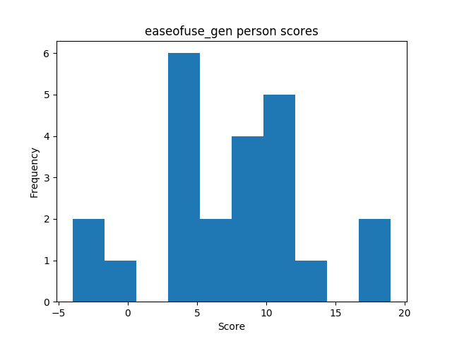

## Descriptives
### Usefulness
#### Flashcard conditions

| | sample | min | max | mean | variance | skew | kurtosis | normal-t | normal-p | $\alpha$ |
|---|---:|---:|---:|---:|---:|---:|---:|---:|---:|---:|
| **ctt** | 12 | -4 |  14 |  6.50 |  27.36 | -0.57 | -0.52 |  1.144 |  0.5643 |  0.6432 |
| **irt** | 12 | -5 |  1 | -0.16 |  4.40 | -1.89 |  3.15 |  17.284 |  0.0002 |  0.6263 |

#### Flashmap conditions

| | sample | min | max | mean | variance | skew | kurtosis | normal-t | normal-p | $\alpha$ |
|---|---:|---:|---:|---:|---:|---:|---:|---:|---:|---:|
| **ctt** | 11 |  0 |  13 |  8.82 |  15.16 | -1.05 |  0.32 |  4.698 |  0.0955 |  0.6777 |
| **irt** | 11 | -3 |  1 | -0.15 |  1.89 | -1.41 |  1.44 |  9.670 |  0.0079 |  0.5298 |

#### Combined conditions

| | sample | min | max | mean | variance | skew | kurtosis | normal-t | normal-p | $\alpha$ |
|---|---:|---:|---:|---:|---:|---:|---:|---:|---:|---:|
| **ctt** | 23 | -4 |  14 |  7.61 |  21.98 | -0.86 | -0.02 |  3.864 |  0.1448 |  0.6509 |
| **irt** | 23 | -3 |  2 |  0.49 |  1.82 | -0.73 |  0.55 |  4.058 |  0.1315 |  0.4619 |

### Ease of use
#### Flashcard conditions

| | sample | min | max | mean | variance | skew | kurtosis | normal-t | normal-p | $\alpha$ |
|---|---:|---:|---:|---:|---:|---:|---:|---:|---:|---:|
| **ctt** | 12 | -4 |  17 |  6.58 |  38.08 | -0.26 | -0.62 |  0.232 |  0.8904 |  0.8794 |
| **irt** | 12 |  0 |  4 |  0.91 |  1.87 |  1.08 |  0.52 |  5.358 |  0.0686 |  0.2295 |

#### Flashmap conditions

| | sample | min | max | mean | variance | skew | kurtosis | normal-t | normal-p | $\alpha$ |
|---|---:|---:|---:|---:|---:|---:|---:|---:|---:|---:|
| **ctt** | 11 |  0 |  19 |  8.27 |  26.22 |  0.50 |  0.12 |  1.725 |  0.4220 |  0.7689 |
| **irt** | 11 | -2 |  2 |  0.22 |  1.87 | -0.20 |  1.01 |  3.041 |  0.2186 |  0.2538 |

#### Combined conditions

| | sample | min | max | mean | variance | skew | kurtosis | normal-t | normal-p | $\alpha$ |
|---|---:|---:|---:|---:|---:|---:|---:|---:|---:|---:|
| **ctt** | 23 | -4 |  19 |  7.39 |  31.70 | -0.08 | -0.10 |  0.239 |  0.8876 |  0.8285 |

## Comparisons
### Perceived usefulness questions

| | **Mann-Whitney-U k** | **Mann-Whitney-U p** | **Welch's t-test k** | **Welch's t-test p** |
|---|---:|---:|---:|---:|
| **ctt** | -1.196 |  0.2449 | -1.212 |  0.2395 |
| **irt** | -0.014 |  0.9891 | -0.014 |  0.9889 |

### Perceived ease of use questions

| | **Mann-Whitney-U k** | **Mann-Whitney-U p** | **Welch's t-test k** | **Welch's t-test p** |
|---|---:|---:|---:|---:|
| **ctt** | -0.711 |  0.4851 | -0.717 |  0.4816 |
| **irt** |  1.206 |  0.2411 |  1.206 |  0.2412 |

